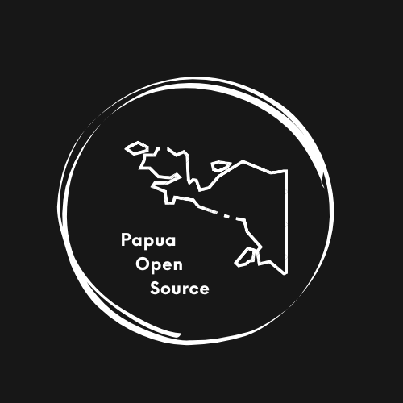

  <picture>
    
  </picture>
  <h2 align="center">
    Papua Open Source
  </h2>

  

    Papua Open Source memfasilitasi kontribusi bersama memajukan perkembangan teknologi di Tanah Papua melalui kolaborasi berbasis Open Source.
     
     
    <a href="https://discord.gg/kuW9EajFrw">Discord</a>
    ·
    <a href="https://papuaopensource.github.io">Website</a>
    ·
    <a href="https://instagram.com/papuaopensource">Instagram</a>
    ·
    <a href="https://x.com/papuaopensource">X</a>
  

## 🚀 Tentang Proyek

Papua Open Source adalah komunitas yang didedikasikan untuk memajukan penggunaan dan pengembangan teknologi open source di Tanah Papua. Website ini berfungsi sebagai platform untuk:

- Berbagi informasi tentang komunitas dan kegiatannya
- Menampilkan proyek-proyek open source yang dikembangkan
- Memandu kontributor baru untuk bergabung
- Menyediakan kontak dan informasi untuk bergabung dengan komunitas

## 🧰 Teknologi

Proyek ini dibangun menggunakan:

- **[Astro](https://astro.build)** - Web framework untuk konten-fokus website
- **[Tailwind CSS](https://tailwindcss.com)** - Framework CSS untuk styling
- **[React](https://reactjs.org)** - Library JavaScript untuk komponen interaktif
- **[shadcn/ui](https://ui.shadcn.com)** - Komponen UI yang dapat digunakan ulang
- **[Lucide Icons](https://lucide.dev)** - Set ikon open source

## 📝 Lisensi

Proyek ini dilisensikan di bawah lisensi MIT - lihat file [LICENSE](LICENSE) untuk detail.
